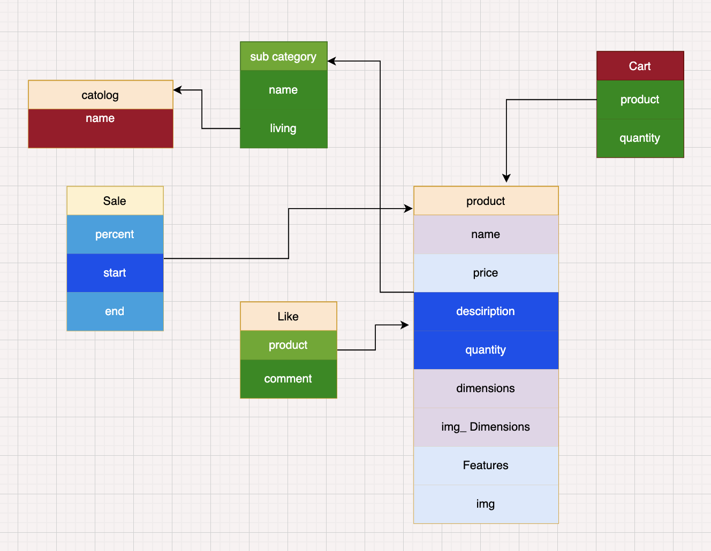

<https://majidovdiyorbek.pythonanywhere.com/>

The modani API has the following endpoints:

|method   |endpoint   |description   |
| ------------- |:-------------:| -----:|
|POST   |<a href = "#add_catalog">`catologs/`</a>|add catolog        |
|GET  |<a href = "#get_catalog">`getcatolog/`</a>|get catologs          |
|POST  |<a href = "#update_catalog">`updatecatolog/<int:id>/`</a>|update catolog by id          |
|POST  |<a href = "#delete_catalog">`deletcatolog/<int:id>/`</a>|delete catolog by id        |
|POST  |<a href = "#add_subproduct">`sub_catogry/`</a>|add product          |
|GET  |<a href = "#get_subproduct">`sub_catogryget/<int:id>/`</a>|get products          |
|POST  |<a href = "#update_subproduct">`updatesubcatogry/<int:id>/`</a>|update product by id    |
|POST  |<a href = "#delete_subproduct">`deletsubcatogry/<int:id>/`</a>|delete product by id    |
|GET |<a href = "#get_subproduct">`subcatogry/<int:pk>/`</a>|get products          |
|POST  |<a href = "#add_product">`product/`</a>|add product     |
|GET  |<a href = "#get_product">`getproduct/<int:id>/`</a>|get products     |
|POST  |<a href = "#update_product">`updateproduct/<int:id>/`</a>|update product by id       |
|POST |<a href = "#delete_product">`deletproduct/<int:id>/`</a>|delete product by id        |
|POST  |<a href = "#add_cart">`cart/`</a>|add cart      |
|GET  |<a href = "#get_cart">`cartget/<int:id>/`</a>|get carts      |
|POST  |<a href = "#update_cart">`cartupdate/<int:id>/`</a>|update cart by id       |
|POST |<a href = "#delete_cart">`cartdelet/<int:id>/`</a>|delete cart by id         |
|POST  |<a href = "#add_sale">`sale/`</a>|add sale      |
|GET  |<a href = "#get_sale">`saleget/<int:id>/`</a>|get sales      |
|POST  |<a href = "#update_sale">`saleupdate/<int:id>/`</a>|update sale by id       |
|POST |<a href = "#delete_sale">`saledelet/<int:id>/`</a>|delete sale by id          |
|POST  |<a href = "#add_like">`like/`</a>|add like      |
|GET  |<a href = "#get_like">`likeget/<int:id>/`</a>|get likes      |
|POST  |<a href = "#update_like">`likeupdate/<int:id>/`</a>|update like by id       |
|POST  |<a href = "#delete_like">`likedelet/<int:id>/`</a>|delete like by id    |


# Model
## you can find this image from [this link](https://app.diagrams.net/#G1Kt5Z4bO88bhWJrlhcsGTbzqfw991eCt7)

<br><br><br><br>
<hr>

<hr>

<div id="add_catalog"> 

**POST** ```api/add_catalog```
### url to add directory
```python
        input:
            {
                "name": str,
            }
        return: json ->
            {
                "id": int,
                "name":str,
            }
        
```
<a href = "#base">^ to the top ^</a> 
</div>
<hr>

<div id="get_catalog">

**GET** ```api/get_catalog```
### url to get directory
```python
        input:
            {
                "id": int,
            }
        return: json ->
            {
                "id": int,
                "name":str,
            }
        
```
<a href = "#base">^ to the top ^</a>
</div>
<hr>

<div id="update_catalog">

**POST** ```api/update_catalog/<int:id>```
### url to update directory
```python
        input:
            {
                "id": int,
                "name": str,
            }
        return: json ->
            {
                "id": int,
                "name":str,
            }
        
```
<a href = "#base">^ to the top ^</a>
</div>
<hr>

<div id="delete_catalog">

**POST** ```api/delete_catalog/<int:id>```
### url to delete directory
```python
        input:
            {
                "id": int,
            }
        return: json ->
            {
                "id": int,
                "name":str,
            }
        
```
<a href = "#base">^ to the top ^</a>
</div>
<hr>

<div id="add_subproduct">

**POST** ```api/add_subproduct```
### url to add subproduct
```python
        input:
            {
                "name": str,
                "catalog": int,
            }
        return: json ->
            {
                "id": int,
                "name":str,
                "catalog":int,
            }
        
```
<a href = "#base">^ to the top ^</a>
</div>
<hr>

<div id="get_subproduct">

**GET** ```api/get_subproduct/<int:id>```
### url to get subproduct
```python
        input:
            {
                "id": int,
            }
        return: json ->
            {
                "id": int,
                "name":str,
                "catalog":int,
            }
        
```
<a href = "#base">^ to the top ^</a>
</div>
<hr>

<div id="update_subproduct">

**POST** ```api/update_subproduct/<int:id>```
### url to update subproduct
```python
        input:
            {
                "id": int,
                "name": str,
                "catalog": int,
            }
        return: json ->
            {
                "id": int,
                "name":str,
                "catalog":int,
            }
        
```
<a href = "#base">^ to the top ^</a>
</div>
<hr>

<div id="delete_subproduct">

**POST** ```api/delete_subproduct/<int:id>```
### url to delete subproduct
```python
        input:
            {
                "id": int,
            }
        return: json ->
            {
                "id": int,
                "name":str,
                "catalog":int,
            }
        
```
<a href = "#base">^ to the top ^</a>
</div>
<hr>

<div id="add_product">

**POST** ```api/add_product```
### url to add product
```python
        input:
            {
                "name": str,
                "sub_catogry": int,
                "price": int,
                "description": str,
                "image": str,
                "img_dimensions": str,
                "dimensions": str,
                "features": str,
                "quantity": int,

            }
        return: json ->
            {
                "id": int,
                "name":str,
                "sub_catogry":int,
                "price":int,
                "description":str,
                "image":str,
                "img_dimensions": str,
                "dimensions": str,
                "features": str,
                "quantity": int,
            }
        
```
<a href = "#base">^ to the top ^</a>
</div>
<hr>

<div id="get_product">

**GET** ```api/get_product/<int:id>```
### url to get product
```python
        input:
            {
                "id": int,
            }
        return: json ->
            {
                "id": int,
                "name":str,
                "sub_catogry":int,
                "price":int,
                "description":str,
                "image":str,
                "img_dimensions": str,
                "dimensions": str,
                "features": str,
                "quantity": int,
            }
        
```
<a href = "#base">^ to the top ^</a>
</div>
<hr>

<div id="update_product">

**POST** ```api/update_product/<int:id>```
### url to update product
```python
        input:
            {
                "id": int,
                "name": str,
                "sub_catogry": int,
                "price": int,
                "description": str,
                "image": str,
                "img_dimensions": str,
                "dimensions": str,
                "features": str,
                "quantity": int,
            }
        return: json ->
            {
                "id": int,
                "name":str,
                "sub_catogry":int,
                "price":int,
                "description":str,
                "image":str,
                "img_dimensions": str,
                "dimensions": str,
                "features": str,
                "quantity": int,
            }
        
```
<a href = "#base">^ to the top ^</a>
</div>
<hr>

<div id="delete_product">

**POST** ```api/delete_product/<int:id>```
### url to delete product
```python
        input:
            {
                "id": int,
            }
        return: json ->
            {
                "id": int,
                "name":str,
                "sub_catogry":int,
                "price":int,
                "description":str,
                "image":str,
                "img_dimensions": str,
                "dimensions": str,
                "features": str,
                "quantity": int,
            }
        
```
<a href = "#base">^ to the top ^</a>
</div>
<hr>

<div id="add_cart">

**POST** ```api/add_cart```
### url to add cart
```python
        input:
            {
                "product": int,
                "quantity": int,
            }
        return: json ->
            {
                "id": int,
                "product":int,
                "quantity":int,
            }
        
```
<a href = "#base">^ to the top ^</a>
</div>
<hr>

<div id="get_cart">

**GET** ```api/get_cart/<int:id>```
### url to get cart
```python
        input:
            {
                "id": int,
            }
        return: json ->
            {
                "id": int,
                "product":int,
                "quantity":int,
            }
        
```
<a href = "#base">^ to the top ^</a>
</div>
<hr>

<div id="update_cart">

**POST** ```api/update_cart/<int:id>```
### url to update cart
```python
        input:
            {
                "id": int,
                "product": int,
                "quantity": int,
            }
        return: json ->
            {
                "id": int,
                "product":int,
                "quantity":int,
            }
        
```
<a href = "#base">^ to the top ^</a>
</div>
<hr>

<div id="delete_cart">

**POST** ```api/delete_cart/<int:id>```
### url to delete cart
```python
        input:
            {
                "id": int,
            }
        return: json ->
            {
                "id": int,
                "product":int,
                "quantity":int,
            }
        
```
<a href = "#base">^ to the top ^</a>
</div>
<hr>

<div id="add_sale">

**POST** ```api/add_sale```
### url to add sale
```python
        input:
            {
                "product": list,
                "quantity": int,
                "percent": int,
                "date": str,
            }
        return: json ->
            {
                "id": int,
                "product":list,
                "quantity":int,
                "percent":int,
                "date":str,
            }
        
```
<a href = "#base">^ to the top ^</a>
</div>
<hr>

<div id="get_sale">

**GET** ```api/get_sale/<int:id>```
### url to get sale
```python
        input:
            {
                "id": int,
            }
        return: json ->
            {
                "id": int,
                "product":list,
                "quantity":int,
                "percent":int,
                "date":str,
            }
        
```
<a href = "#base">^ to the top ^</a>
</div>
<hr>

<div id="update_sale">

**POST** ```api/update_sale/<int:id>```
### url to update sale
```python
        input:
            {
                "id": int,
                "product": list,
                "quantity": int,
                "percent": int,
                "date": str,
            }
        return: json ->
            {
                "id": int,
                "product":list,
                "quantity":int,
                "percent":int,
                "date":str,
            }
        
```
<a href = "#base">^ to the top ^</a>
</div>
<hr>

<div id="delete_sale">

**POST** ```api/delete_sale/<int:id>```
### url to delete sale
```python
        input:
            {
                "id": int,
            }
        return: json ->
            {
                "id": int,
                "product":list,
                "quantity":int,
                "percent":int,
                "date":str,
            }
        
```
<a href = "#base">^ to the top ^</a>
</div>
<hr>

<div id="add_like">

**POST** ```api/add_like```
### url to add like
```python
        input:
            {
                "product": int,
                "comment": str,
            }
        return: json ->
            {
                "id": int,
                "product":int,
                "comment":str,
            }
        
```
<a href = "#base">^ to the top ^</a>
</div>
<hr>

<div id="get_like">

**GET** ```api/get_like/<int:id>```
### url to get like
```python
        input:
            {
                "id": int,
            }
        return: json ->
            {
                "id": int,
                "product":int,
                "comment":str,
            }
        
```
<a href = "#base">^ to the top ^</a>
</div>
<hr>

<div id="update_like">

**POST** ```api/update_like/<int:id>```
### url to update like
```python
        input:
            {
                "id": int,
                "product": int,
                "comment": str,
            }
        return: json ->
            {
                "id": int,
                "product":int,
                "comment":str,
            }
        
```
<a href = "#base">^ to the top ^</a>
</div>
<hr>

<div id="delete_like">

**POST** ```api/delete_like/<int:id>```
### url to delete like
```python
        input:
            {
                "id": int,
            }
        return: json ->
            {
                "id": int,
                "product":int,
                "comment":str,
            }
        
```
<a href = "#base">^ to the top ^</a>
</div>
<hr>


